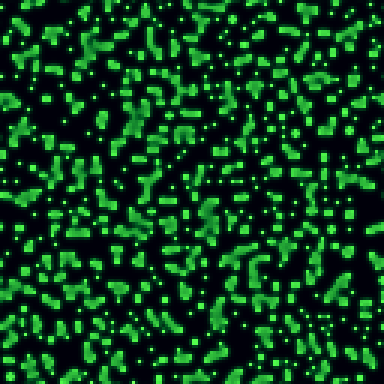
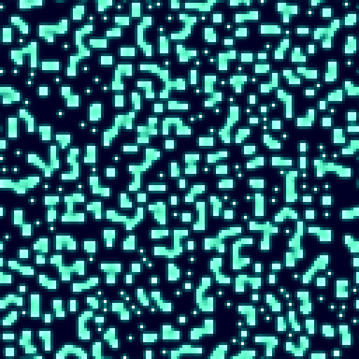
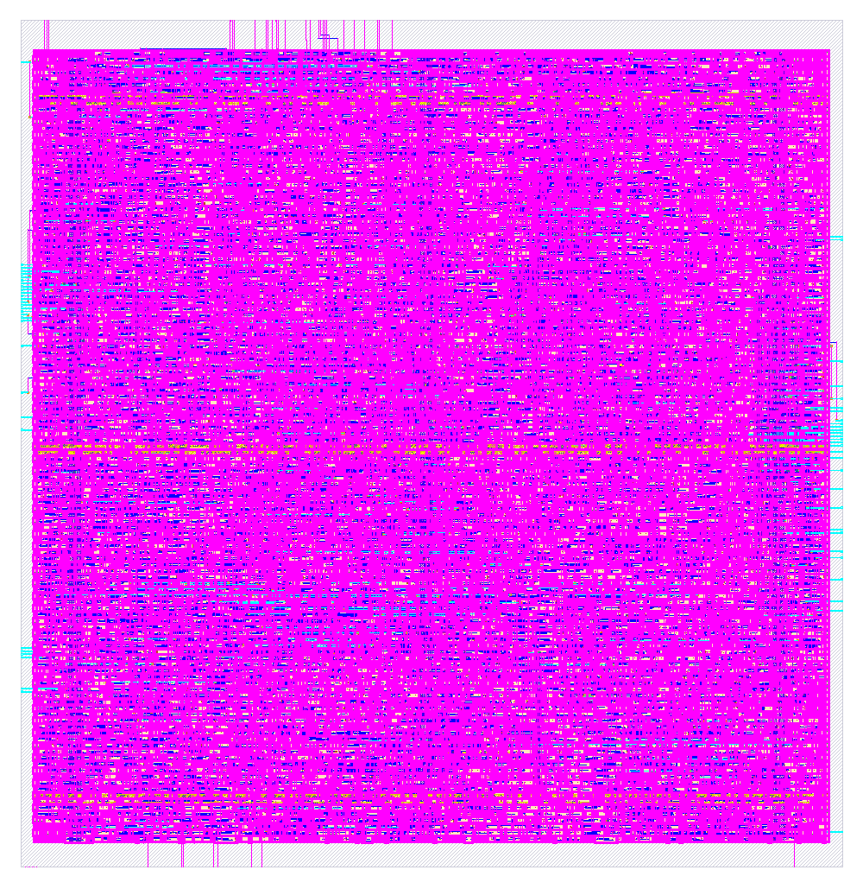

# Turing — a reaction-diffusion ASIC

**An open-source chip that grows living Turing patterns in silicon.**

`Turing` hardens the Gray-Scott reaction-diffusion model — the maths behind the
spots on a leopard, the stripes on a zebra and the mazes in a coral — into a
real RTL-to-GDSII design on the open SkyWater **sky130** 130 nm PDK. Two coupled
chemical fields evolve on a toroidal grid; structure nucleates from noise and
never stops changing.

As far as I can tell this is the **first reaction-diffusion design taken all the
way to GDSII**. Software, GPU and FPGA implementations exist; an open,
sign-off-clean ASIC does not.



---

## Contents

- [What it does](#what-it-does)
- [The maths](#the-maths)
- [Interface (ports)](#interface-ports)
- [Memory format](#memory-format)
- [Clocking & throughput](#clocking--throughput)
- [How it works, cycle by cycle](#how-it-works-cycle-by-cycle)
- [Parameters](#parameters)
- [Results (sky130 sign-off)](#results-sky130-sign-off)
- [Verification](#verification)
- [Reproduce](#reproduce)
- [Roadmap](#roadmap)
- [License](#license)

---

## What it does

The chip is a **streaming Gray-Scott engine**. Two scalar fields, `U` and `V`,
live on a `GRID_W × GRID_H` toroidal grid in external memory. On every *frame*
the engine sweeps all cells in raster order and applies the update

```
U' = U + Du·∇²U − U·V² + F·(1 − U)
V' = V + Dv·∇²V + U·V² − (F + k)·V
```

writing the result into a second buffer, then swaps buffers and runs the next
frame — forever. Patterns emerge after a few hundred frames and keep evolving.

Everything is fixed-point **Q4.12** (16-bit words, 12 fractional bits, field
values in `[0, 1.0]`). The design is fully deterministic: given the same seed it
produces bit-identical output to a software reference, every time.



## The maths

Each cell reads its 8 toroidal neighbours and applies a 9-point Laplacian
(Pearson kernel: 0.05 on diagonals, 0.20 on orthogonals, −1.0 on the centre),
then steps both fields. No floating point and no division anywhere — only
additions, shifts and small fixed-point multiplies. The default **maze**
regime (`F = 0.030`, `k = 0.057`) fills the grid with a connected labyrinth;
other `(F, k)` pairs give spots, worms, mitosis and coral textures.

The core is **pure logic** — no RAM macro inside. Grid storage is an external
dual-buffer SRAM (two banks of `GRID_W·GRID_H` 32-bit words), which keeps the
core small, portable and easy to harden.

## Interface (ports)

| Port         | Dir | Width  | Description                                                        |
|--------------|-----|--------|--------------------------------------------------------------------|
| `clk_i`      | in  | 1      | System clock. Single clock domain.                                 |
| `rst_ni`     | in  | 1      | Asynchronous active-low reset.                                     |
| `start_i`    | in  | 1      | Pulse high for one cycle to begin running frames continuously.     |
| `buf_sel_o`  | out | 1      | Which framebuffer bank is currently the **read** bank (write = ¬). |
| `frame_o`    | out | 1      | Pulses high for one cycle at the end of every full frame.          |
| `rd_addr_o`  | out | `AW`   | Read address (cell index) into the current read bank.              |
| `rd_en_o`    | out | 1      | Read strobe; address is valid this cycle, data expected next.      |
| `rd_data_i`  | in  | 32     | Cell read back: `{V[15:0], U[15:0]}` in Q4.12.                     |
| `wr_addr_o`  | out | `AW`   | Write address (cell index) into the write bank.                    |
| `wr_data_o`  | out | 32     | Next-state cell: `{V[15:0], U[15:0]}` in Q4.12.                    |
| `wr_en_o`    | out | 1      | Write strobe.                                                      |

The host wraps `{buf_sel_o, addr}` into a physical SRAM address. Read latency is
assumed to be **one cycle** (synchronous SRAM): drive `rd_addr_o`/`rd_en_o`,
sample `rd_data_i` on the following clock.

## Memory format

Each grid cell is one **32-bit word**: the low half is `U`, the high half is
`V`, both unsigned **Q4.12** (`0x0000` = 0.0, `0x1000` = 1.0). Two banks of
`GRID_W·GRID_H` words form the ping-pong framebuffer. Cell `(row, col)` lives at
address `row·GRID_W + col`.

## Clocking & throughput

- **One clock domain** (`clk_i`); async active-low reset (`rst_ni`).
- Sign-off closes at **28 ns (≈ 36 MHz)** with +3.82 ns slack; the real path
  floor is ≈ 19 ns, so ≈ 50 MHz is reachable with margin tuning.
- The engine spends **~16 cycles per cell** (9 neighbour reads + 3-stage
  pipeline fill + write + sweep overhead). A frame is `GRID_W·GRID_H` cells.
- Example: a 128×128 grid at 36 MHz ≈ **150 frames/second** of reaction-diffusion
  evolution — far faster than the pattern needs to look alive.

## How it works, cycle by cycle

The sweep FSM, per cell:

1. **READ** — issues 9 reads (centre + 8 toroidal neighbours), latching each
   returned word into a 3×3 window register for `U` and `V`. Toroidal wrap is
   handled in the address generator.
2. **COMPUTE** — the window is held stable while the 3-stage `rd_cell_pipe`
   produces the next-state `(U, V)` after its pipeline latency; the result is
   registered.
3. **WRITE** — the registered next-state word is written to the *other* bank at
   the same `(row, col)`.

After the last cell, `buf_sel_o` toggles, `frame_o` pulses, and the next frame
begins from the freshly written bank.

## Parameters

| Parameter | Default | Meaning                          |
|-----------|---------|----------------------------------|
| `GRID_W`  | 128     | Grid width (cells)               |
| `GRID_H`  | 128     | Grid height (cells)              |
| `CW`      | 7       | `clog2(GRID_W)`                  |
| `RW`      | 7       | `clog2(GRID_H)`                  |
| `AW`      | 14      | Cell address width (`CW + RW`)   |

The reaction constants (`Du, Dv, F, k`, Laplacian weights) are fixed Q4.12
`localparam`s inside `rd_cell_pipe`; change them to switch pattern regime.

## Results (sky130 sign-off)

Hardened with the open flow (Yosys → OpenROAD → KLayout) via LibreLane 3.0.3.
The render below is the actual placed-and-routed layout.

| Metric              | Value                              |
|---------------------|------------------------------------|
| Process             | SkyWater sky130 (130 nm)           |
| Standard cells      | 21,048                             |
| Core area           | 121,236 µm²                        |
| Core utilization    | 69 %                               |
| Clock               | 28 ns (≈ 36 MHz); path floor ≈ 19 ns |
| Setup worst slack   | **+3.73 ns (MET)**                 |
| Hold worst slack    | **+0.10 ns (MET)**                 |
| Total power         | 21.8 mW                            |
| Magic + KLayout DRC | **0 violations**                   |
| Netgen LVS          | **0 errors (match)**               |



A first non-pipelined pass came in at 267,206 µm² / 198 mW. Pipelining the
kernel and sizing the multipliers to the real 13-bit operand range (the field
values only span `[0, 4096]`) cut area **−55 %**, power **−89 %** and cells
**−65 %** — while staying bit-exact.

## Verification

- `rd_cell` — bit-exact vs a Python golden model over 500 random neighbour
  windows.
- `rd_engine` — bit-exact vs the golden model over **150 full frames** of chaotic
  dynamics on a 32×32 torus; zero divergence.
- Q4.12 fixed-point confirmed to reproduce the float reference pattern (the chip
  is deterministic from a given seed).

## Reproduce

```bash
# 1. functional sim (Icarus + cocotb), engine vs golden
cd tb && make -f Makefile_eng

# 2. golden reference + the GIF above
cd golden && python3 gray_scott.py

# 3. RTL -> GDSII (requires Nix + LibreLane)
cd openlane/rd_engine
nix run github:librelane/librelane/3.0.3 -- config.json
```

RTL is SystemVerilog; `sv2v` converts it to Verilog-2005 for the open tools.

## Roadmap

- [ ] VGA/HDMI front-end + colour palette so the chip drives a monitor directly
- [ ] Deeper kernel pipeline for > 50 MHz
- [ ] On-chip SRAM macro (fully self-contained, no external framebuffer)
- [ ] Tape-out on a TinyTapeout / IHP open shuttle

## License

Apache-2.0 — see [LICENSE](LICENSE).
